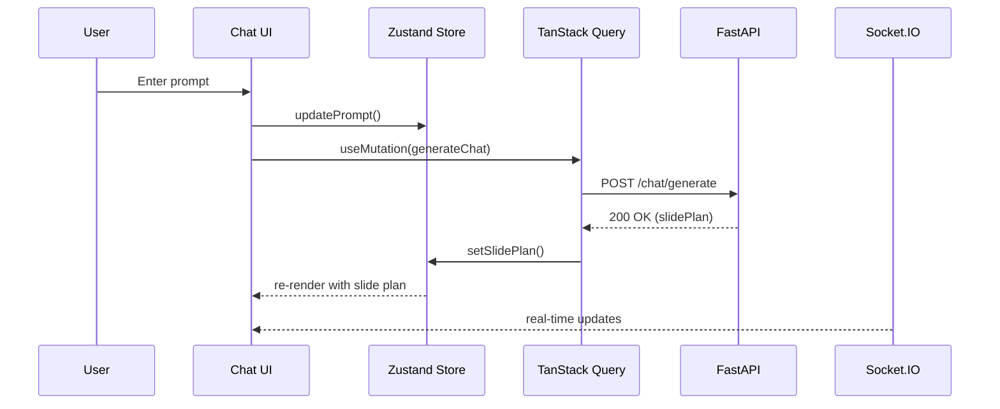
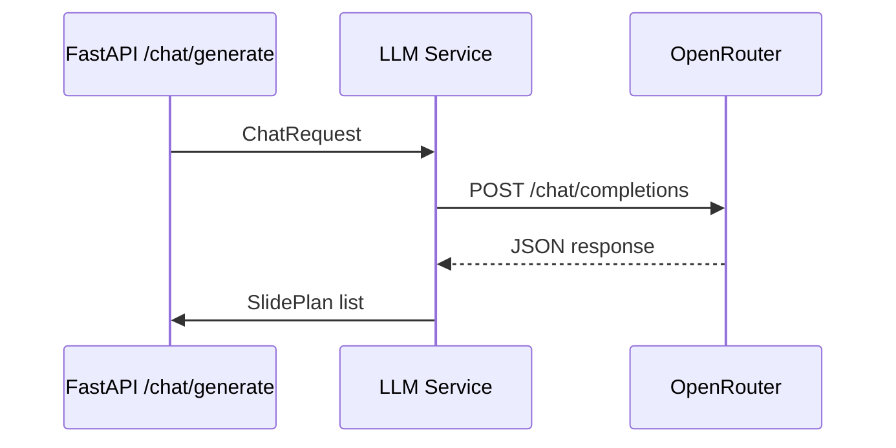
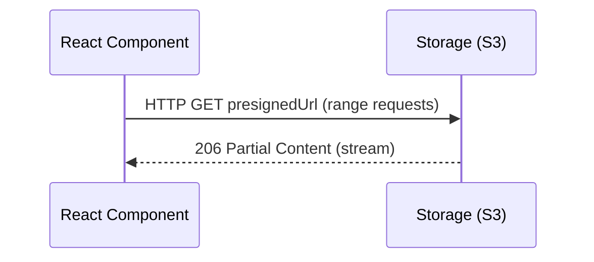

# Module Specs (Updated 2025-07-12)

> **All dependencies, scripts, and tool versions must be strictly pinned to `versions.md`.**
> **All development, testing, and quality checks must be run in Docker or CI for cross-platform reliability.**
> **All contributors must read the planning documents and onboarding sections in the README before making changes.**
> **Troubleshooting:** Always delete `node_modules` and reinstall in Docker when switching between host and container (especially on Windows). Ensure all cache and coverage directories are writable in Docker. See `README.md` and `stage-1-foundation.md` for more tips.

Detailed specification for each module in the AI-PowerPoint-Generator project.

---

## 1. Chat UI Module (`src/components/chat`)

### Overview
Real-time chat interface for prompt entry, slide outline display, and iterative refinement.

### Inputs
| Field | Type | Description |
|-------|------|-------------|
| `sessionId` | `string` | Current chat session identifier |
| `prompt` | `string` | User prompt to generate slides |
| `model` | `string` | Selected LLM model |

### Outputs
| Field | Type | Description |
|-------|------|-------------|
| `slidePlan` | `SlidePlan[]` | Structured slide outline |
| `messages` | `ChatMessage[]` | Chat transcript |

### Public API
```typescript
interface ChatUIProps {
  sessionId?: string
}
```

### Sequence Diagram


### Third-party Packages
- `@tanstack/react-query` for API mutations
- `zustand` for state management
- `socket.io-client` for live updates
- `framer-motion` for animations

### Error Handling
| Error | Strategy |
|-------|----------|
| Network/HTTP 500 | Display toast with retry option |
| ValidationError | Highlight input field |
| WebSocket disconnect | Exponential back-off reconnection |

---

## 2. LLM Service (`backend/services/llm.py`)

### Overview
Handles communication with OpenRouter LLM to create structured slide outlines. Implements strict Pydantic v2 typing, camelCase serialization, and robust error handling with retry logic.

### Inputs
| Field | Type | Description |
|-------|------|-------------|
| `ChatRequest` | Pydantic model | Prompt, slide count, model name |

### Outputs
| Field | Type | Description |
|-------|------|-------------|
| `list[SlidePlan]` | list | Validated outline objects |

### Dependencies
- `httpx.AsyncClient`
- Environment variable `OPENROUTER_KEY`

### Sequence Diagram


### Error Handling
| Error | Handling |
|-------|----------|
| 4xx/5xx from OpenRouter | Raise `HTTPException(502)` |
| JSON decode error | Log + raise `ValueError` |

---

## 3. Image Service (`backend/services/images.py`)

### Overview
Generates images for each slide using Runware API. Implements strict typing, retry logic, and error handling. Uses respx for test mocking.

### Inputs / Outputs
| Input | Output |
|-------|--------|
| `ImagePrompt` | `ImageMeta` (URL, local path) |

### Public API
```python
async def generate_images(slides: list[SlidePlan]) -> list[ImageMeta]:
    ...
```

### Third-party Packages
- `runware` SDK

### Error Handling
- Retry with exponential back-off (`max_retries=3`)

---

## 4. PPTX Builder (`backend/services/pptx.py`)

### Overview
Creates a .pptx file from slide outline + images. Handles missing images with branded placeholder. Strict typing and error handling.

### Inputs
- `slides: list[SlidePlan]`
- `images: list[ImageMeta]`

### Outputs
- `Path` to generated `.pptx`

### Dependencies
- `python-pptx`
- `tempfile`, `pathlib`

### Algorithm Steps
1. `prs = Presentation()`
2. Loop over slides & images
3. Add title, body, picture, speaker notes
4. Save to `/tmp/{uuid}.pptx`

### Error Handling
- Missing image → placeholder image
- IOError → log + propagate

---

## 5. API Client Generation (`openapi-typescript-codegen`)

### Overview
Generates fully typed client based on FastAPI OpenAPI schema.

### CLI Command
```bash
npx openapi-typescript http://localhost:8000/openapi.json \
  -o ./frontend/src/types/api.ts \
  --client fetch \
  --useUnionTypes
```

### Output
- `api.ts` containing:
  - Typed `paths`, `components`
  - Typed fetch wrapper

---

## 6. WebSocket Module (`src/hooks/use-websocket.ts`)

### Overview
Custom hook to manage Socket.IO client connection. Backend uses python-socketio 5, with strict event typing and disconnect handling.

### API
```typescript
export function useWebSocket(sessionId: string) {
  const socket = useMemo(() => io(import.meta.env.VITE_WS_URL, {
    auth: { sessionId },
    autoConnect: false,
  }), [sessionId])

  useEffect(() => {
    socket.connect()
    return () => socket.disconnect()
  }, [socket])

  return socket
}
```

### Events
| Event | Payload | Description |
|-------|---------|-------------|
| `slide:progress` | `{ slideIndex: number }` | Real-time generation progress |
| `slide:completed` | `{ pptxUrl: string }` | Generation finished |

---

## 7. CI/CD Module (`.github/workflows/ci.yml`)

### Stages
1. **Install** – `npm install` (frontend), `pip install -r requirements.txt -r requirements-dev.txt` (backend)
2. **Type Check** – `npm run type-check` (frontend), `docker compose run --rm backend mypy .` (backend)
3. **Lint** – `npm run lint` (frontend), `docker compose run --rm backend ruff . && docker compose run --rm backend black --check .` (backend)
4. **Test** – `npm run test -- --run` (frontend), `docker compose run --rm backend pytest --cov=backend/app --cov-report=term-missing` (backend)
5. **Contract** – `schemathesis` (backend OpenAPI contract tests)
6. **Performance** – `k6` (backend performance scripts)
7. **Build** – `npm run build` (frontend), `docker compose build backend` (backend)
8. **Security** – `bandit` (Python), `trivy` (Docker image)
9. **E2E** – Cypress run on built app (frontend)
10. **Docker Build & Push** – Production image (both)
11. **Deploy** – Kubernetes rolling update (see Stage 5 DevOps)

> **All CI/CD jobs must use pinned versions from `versions.md` and be run in Docker or CI.**

---

## 8. Download Manager (`src/components/download`)  
Handles secure retrieval of generated PPTX, supports retry & resumable download.

### Input
- `presignedUrl: string`

### Output
- Trigger browser download, progress percentage

### Sequence Diagram


### Error Handling
- Expired URL → request new token
- Network error → resume with `Range` header

---

## 9. Estado Store (Zustand)

### `ChatStore`
| Field | Type | Description |
|-------|------|-------------|
| `messages` | `ChatMessage[]` | All chat messages |
| `slidePlan` | `SlidePlan[]` | Current slide outline |
| `isGenerating` | `boolean` | Generation loading flag |

### `SlideStore`
| Field | Type | Description |
|-------|------|-------------|
| `slides` | `Slide[]` | Finalised slides |
| `pptxUrl` | `string` | Download link |
| `progress` | `number` | Generation progress |

### Actions
- `addMessage(msg)`, `setSlidePlan(plan)`, `setProgress(n)`

---

## 10. Testing Matrix

| Test | Tool | Expected Outcome |
|------|------|------------------|
| **Unit** – `pptx.py` | pytest | File generated, contains X slides |
| **Integration** – chat flow | pytest + httpx | `/chat/generate` returns 200 |
| **E2E** – full deck | Cypress | User can create & download PPTX |
| **Load** – 100 simultaneous chats | Locust | <2% error rate |

---

## 11. Compliance & Onboarding Checklist
- [ ] All dependencies, scripts, and tool versions are pinned to `versions.md`.
- [ ] All development, testing, and quality checks are run in Docker or CI.
- [ ] All contributors have read and followed onboarding and planning docs.
- [ ] Troubleshooting tips for cross-platform reliability are followed (see README and planning docs).

---

These specifications provide developers with the detailed interfaces, contracts, and expected behaviours necessary to implement and maintain each module confidently.

**Document version:** 2.0  
**Last Updated:** 2025-07-12